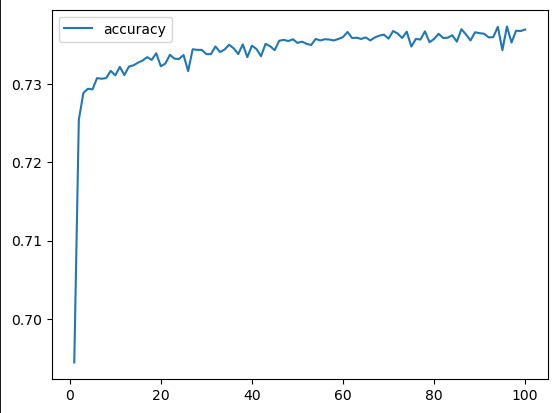
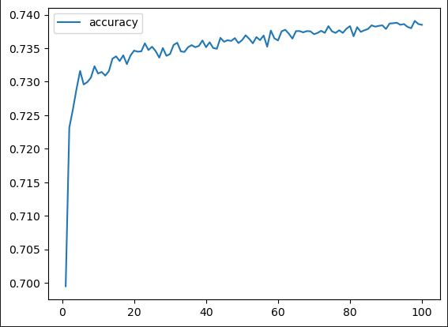
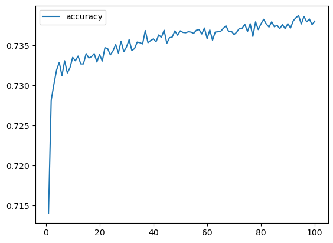

# deep-learning-challenge
Project Overview
The aim of this initiative is to develop a machine learning and neural network-based algorithm. This algorithm will predict the likelihood of applicant success when funded by the fictitious non-profit organization, Alphabet Soup.

# Process Description
I used a CSV file containing information on over 34,000 organizations previously funded by Alphabet Soup, along with their detailed metadata, which I imported into Pandas.

# Data Preprocessing
Steps taken in data preprocessing included:

Eliminating columns that weren't useful.
Identifying the number of instances for each unique value in columns with more than 10 unique values, namely APPLICATION_TYPE and CLASSIFICATION.
Setting thresholds of 600 and 300 for APPLICATION_TYPE and CLASSIFICATION, respectively, to group infrequent categories under a new "Other" category.
Converting categorical data into numeric format using pd.get_dummies().
Splitting the data into target (IS_SUCCESSFUL) and feature arrays.
Dividing the dataset into training and testing groups using train_test_split.
Scaling both training and testing data sets with StandardScaler.
The final dataset comprised 44 features, with IS_SUCCESSFUL as the target variable, divided into training and test subsets.

# Model Compilation, Training, and Evaluation
The objective was to surpass a predictive accuracy of 75%. I undertook three attempts using machine learning and neural networks, each yielding an accuracy of approximately 72%, slightly below the target.

Details of each attempt are as follows:

# Attempt 1

Model Path: Resources/AlphabetSoupCharity1.h5
Achieved Accuracy: 72.8%
Configuration: 2 layers (9 and 18 neurons with 'relu' activation), 100 epochs.
Observation: This was the highest accuracy amongst all attempts.

# Attempt 2

Model Path: Resources/AlphabetSoupCharity2.h5
Achieved Accuracy: 72.6%
Configuration: 3 layers (9, 18, and 27 neurons, all with 'relu' activation), 100 epochs.

# Attempt 3

Model Path: Resources/AlphabetSoupCharity3.h5
Achieved Accuracy: 72.7%
Configuration: 3 layers (9 neurons with 'relu' activation; 18 and 27 neurons with 'tanh' activation), 100 epochs.

# Summary
Across all three attempts, the highest predictive accuracy achieved was 72.8%, falling short of the 75% target. Adjusting hyperparameters resulted in negligible improvements. Considering these results, exploring a different classification model could be beneficial in predicting the success of Alphabet Soup's funding applicants more accurately.